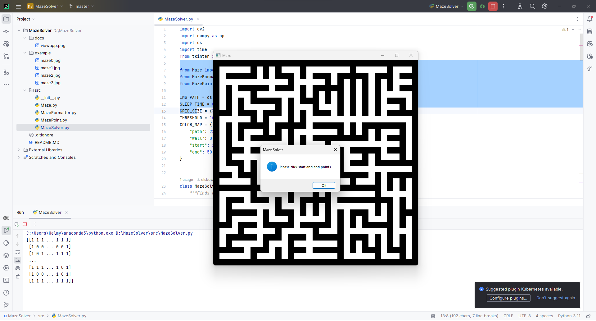
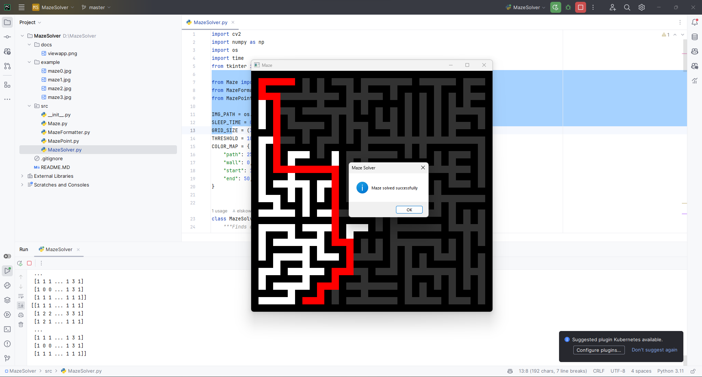

# Maze Solver - BFS on Python

A simple maze solver using BFS algorithm with GUI on Python. Made for the course of Artificial Intelligence at State University of Surabaya. 

> Not finished yet, still need to add some features.