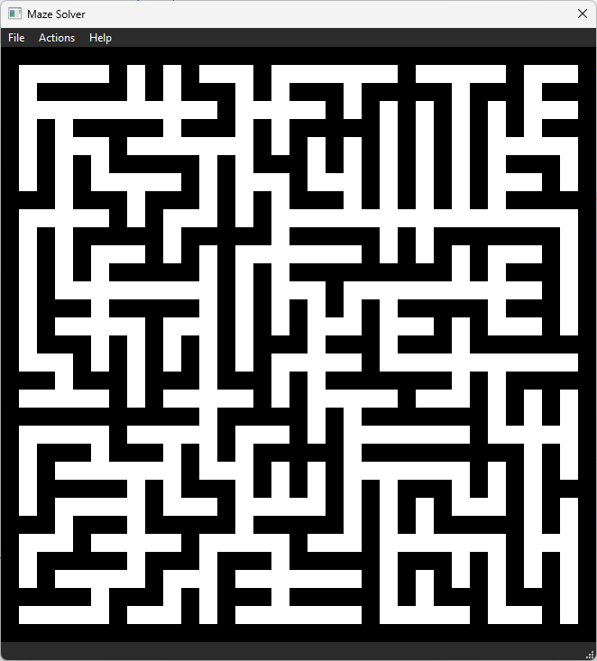
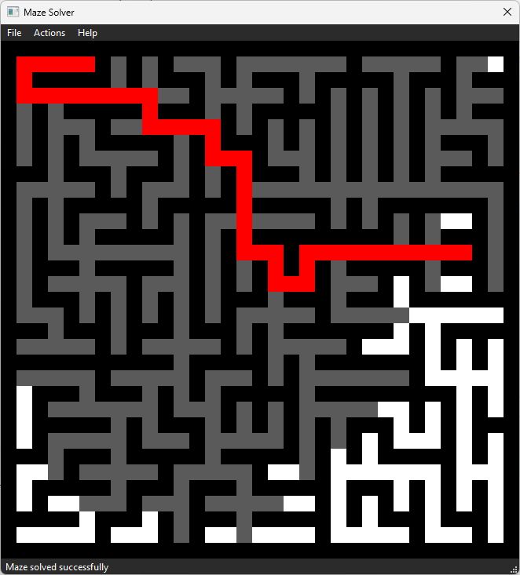
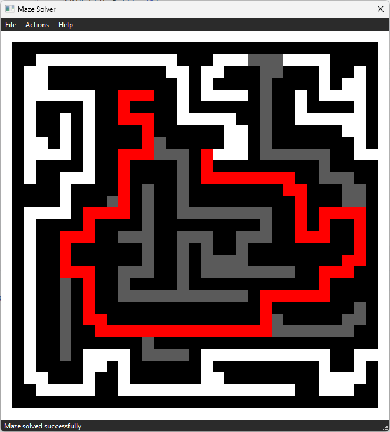

# Maze Solver - BFS on Python


A simple maze solver using BFS algorithm with GUI on Python. Made for the course of Artificial Intelligence at State University of Surabaya. 

---
## How to run
1. Install Dependencies
    ```bash
    poetry install
    ```
2. Run shell
    ```bash
    poetry shell
    ```
3. Install pyqt5
    ```bash
    pip install pyqt5
    ```
    > It's not included in the poetry dependencies because it's not working on poetry shell, so you need to install it manually on venv of poetry shell.
4. Run the program
    ```bash
    python main.py
    ```
---

## Screenshots


